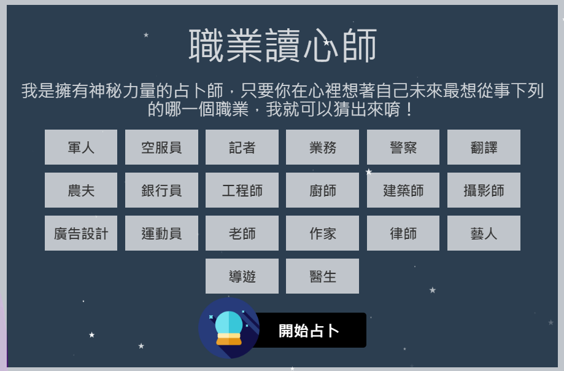

# MindReader 職業讀心師
 
 
 
### 關於職業讀心師

 
使用React與Node.js框架進行開發，資料庫mLab(MongoDB)。 
串接機器學習問答 https://mindreader.johnthunder.one/  
後台統計系統，紀錄所有使用者結果，並且依照場次進行統計 
#### 路由表Router :  
<code>
/ -> 首頁 
/admin -> 後台統計 
</code> 
#### 版本需求Require :  
Node.js : 6.10.0 LTS 
MongoDB : 4.3 
### 結構示意
#### JSON資料 
Record : { 
&nbsp;&nbsp;EventName : String 
&nbsp;&nbsp;Professions : [{ 
&nbsp;&nbsp;&nbsp;&nbsp;&nbsp;Profession : String 
&nbsp;&nbsp;&nbsp;&nbsp;&nbsp;Count : Number 
&nbsp;&nbsp;}] 
} 
每一筆資料(Record)紀載活動場次與測試紀錄，於後端中顯示各項總和(Sum)。 
呼叫 : GET /record 可以取得紀錄。 
呼叫 : POST /record 可以上傳紀錄。 
  

